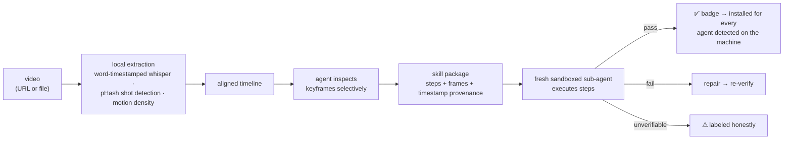

<div align="center">
  <a href="https://v2s.dev">
    
  </a>

# video-to-skill

_Teach your AI from any video — turn tutorials into installable, **verified** agent skills._

[](https://github.com/brenoepics/video-to-skill/releases)
[](https://github.com/brenoepics/video-to-skill/releases/latest)
[](https://github.com/brenoepics/video-to-skill/actions/workflows/ci.yml)
[](LICENSE)

**[v2s.dev](https://v2s.dev)** · [Install](#install) · [Why](#why-not-just-the-transcript) · [How it works](#how-it-works) · [Benchmarks](BENCHMARK.md) · [Security](SECURITY.md)

</div>

## Kodawari prompt extension

This public copy adds a prompt-output path to the upstream skill. In
`generate` mode it produces both an installable skill and reusable prompts
under `prompts/`. In `prompt` mode it produces prompts only. Each prompt
records inputs, an output contract, stop conditions, and timestamp evidence.
Run `scripts/validate-prompts.py` before treating generated prompts as
complete. The upstream MIT license and safety design are retained.

**video-to-skill** turns any video — a YouTube URL or a local file — into an installable agent skill. It listens, but it *reads the screen*: every step cites the frame it came from, and the badge is earned by executing the steps in a sandbox.

## Install

```bash
npx skills@latest add brenoepics/video-to-skill
```

> [!TIP]
> That's the entire setup. First use auto-bootstraps a prebuilt Rust extractor, static ffmpeg, yt-dlp, and whisper weights — all checksum-pinned. No Homebrew, no Python, no accounts, no API keys. Whisper runs Metal-accelerated on Apple Silicon ([benchmarks](BENCHMARK.md)).

Then:

```
/video-to-skill https://youtube.com/watch?v=...   → analyzes, compiles, verifies, installs
/vim-basics                                       → your agent now knows what the video taught
```

> [!NOTE]
> The generated skill is installed for **every** agent detected on your machine, not just the one that made it: one real copy in the universal `~/.agents/skills`, and a relative symlink from each of Claude Code, Codex, Cursor, Gemini CLI, GitHub Copilot, OpenCode, and Amp that is actually installed. One source of truth, so a later fold reaches all of them. Installing is consent-gated: `vts-extract install --package <dir>` prints the exact plan and writes nothing until you re-run it with `--yes`.

## Why not just the transcript

A whisper model transcribed an Excel tutorial and heard **"some"** — the pixels on screen read **`=SUM(B3:B10)`**. Real failures from real runs:

| Whisper / narration said | The frame reads | What ships |
|---|---|---|
| "some" | `=SUM(B3:B10)` | the formula |
| "QBang" | `:q! — quit, discard changes` | `:q!` |
| "the first extension called Vim" | `vscodevim.vim` v1.18.9 | the exact extension id |

Transcript-only tools ship the left column. Here, on-screen text outranks narration: commands are read off pixels, never paraphrased.

## Verification is execution, not vibes

A fresh sub-agent — seeing only the generated package, not the video — runs each step against its success criteria before the badge is written. It runs them inside an OS sandbox: no network, writes confined to a throwaway workspace, credential stores unreadable. Where the machine offers no sandbox, execution is refused and the steps are badged honestly rather than run unconfined.

> [!NOTE]
> Case in point: one tutorial's paste step compiled to `"+P`, which pastes from Vim's *internal* register, not the clipboard. The sandbox executed it, the criterion failed, the repair loop corrected it to `"+p` and re-verified against the real macOS pasteboard. Steps that would be unsafe to execute are skipped by policy and say so — no silent green.

## What a generated skill looks like

```yaml
name: vim-basics
badge: "✅ Verified by execution — 7 passed, 2 skipped by safety policy"
```

Every step carries `[t=MM:SS]` provenance plus the actual frame it came from — `01-quit-vim` cites `[t=0:54]` with the frame showing `:q!`. Anything not visually confirmed ships flagged low-confidence. Non-procedural videos are refused with an analysis report — never fabricated into steps.

## How it works



## Skills that grow

Feed it a second video of the same task and it folds in: agreements gain dual provenance and a confidence bump; conflicts become cited variants, never overwrites; a Sources section records the fold history. The `vim-basics` skill above is two different Vim tutorials folded into one. Folding invalidates the badge — verification re-runs before reinstall.

## How it compares

Two tool families sound similar. Neither does this job:

| | Video-to-docs (Loom AI, Scribe, summarizers) | Workflow recorders | **video-to-skill** |
|---|:---:|:---:|:---:|
| Works on any pre-existing video (URL or file) | ✅ | ❌ needs live capture of *your* session | ✅ |
| Output an agent can execute | ❌ human prose | ❌ | ✅ portable skill |
| Commands read from pixels, not narration | ❌ transcript-based | ➖ | ✅ |
| Steps verified by actually running them | ❌ | ❌ | ✅ |
| Per-step `[t=MM:SS]` + frame evidence | ❌ | ❌ | ✅ |

<div align="center">

_Nothing else takes an arbitrary pre-existing video and emits a portable, executable, **verified** skill._

</div>

## Benchmarks

Measured by `vts-extract bench` on a GitHub-hosted macOS runner and committed automatically by CI — CPU-only whisper, so Apple Silicon with Metal runs substantially faster.

<!-- bench-summary:start -->
| 2-min 720p extract | transcription | measured on |
| --- | --- | --- |
| 67.5s wall · 1.8x realtime | 1.3x realtime | Apple M1 (Virtual) (3 cores) |

Full methodology and results: [BENCHMARK.md](BENCHMARK.md)
<!-- bench-summary:end -->

CI numbers come from GitHub's 3-core CPU-only macOS VMs and vary with runner load; on local Apple Silicon with Metal the same suite runs roughly 10× faster (see the [reference run](BENCHMARK.md)). Reproduce on your machine: `vts-extract bench`.

## Privacy

Everything runs locally. The video never leaves your machine; only the frames the agent chooses to inspect ever enter model context.

## Security

> [!IMPORTANT]
> A video is untrusted input that flows toward executable steps — so the boundaries are explicit, and enforced by the kernel where it counts. Verification executes video-derived commands under an OS sandbox with **no network**, writes confined to a throwaway workspace, and credential stores unreadable; where no sandbox exists the run is refused, not downgraded. On-screen credentials are never transcribed — the compiler *refuses* IRs carrying secret-shaped text in any field — and video text addressed to the agent is flagged as suspected prompt injection, never followed. Nothing downloads or installs without showing you the plan first. Every download is version-pinned and checksum-verified, with provenance attestations on the extractor binary.
>
> Full threat model, download inventory, and a **point-by-point response to every marketplace audit finding**: [SECURITY.md](SECURITY.md).

## Honest limitations

- Best on screencasts, CLI/GUI tutorials, and talks. Fast physical demos lose motion detail between keyframes.
- GUI-only claims may be unverifiable by execution — they ship labeled as such, not hidden behind the badge.

## Contributing

See [CONTRIBUTING.md](CONTRIBUTING.md) — TDD, conventional commits, and a 300-line file limit, all enforced. [MIT](LICENSE) licensed.

<div align="center">

Made with care · **[v2s.dev](https://v2s.dev)**

</div>
